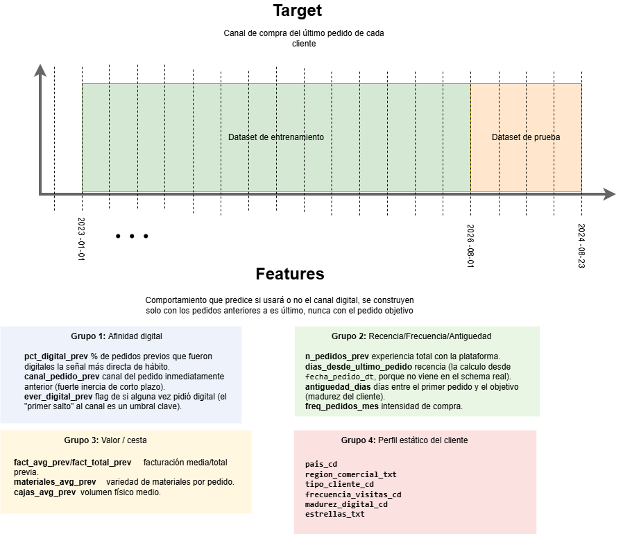

# Predicción de Pedidos Digitales en eB2B

Estimación de la probabilidad de que el **próximo pedido** de un cliente se realice por **canal digital**, con el fin de enfocar esfuerzos comerciales y de comunicación en la plataforma eB2B.

---

## 1. Enfoque seguido

### 1.1 Datos

Dataset transaccional. Además de los campos del enunciado, el dataset entregado incluye dimensiones adicionales del cliente:

| Campo | Tipo | Descripción |
|---|---|---|
| `cliente_id` | id | Identificador del cliente |
| `pais_cd`, `region_comercial_txt` | categórica | Geografía comercial |
| `agencia_id`, `ruta_id` | categórica | Estructura de distribución |
| `tipo_cliente_cd` | categórica | Segmento de cliente |
| `madurez_digital_cd`, `estrellas_txt` | categórica | Atributos de perfil  |
| `frecuencia_visitas_cd` | categórica | Frecuencia de visita comercial |
| `fecha_pedido_dt` | timestamp | Fecha del pedido |
| `canal_pedido_cd` | categórica | DIGITAL / VENDEDOR / TELEFONO |
| `facturacion_usd_val`, `materiales_distintos_val`, `cajas_fisicas` | numérica | Métricas del pedido |

**Periodo cubierto:** 2023-01-01 a 2024-08-23.

### 1.2 Definición del problema y de la target

El dataset es transaccional, pero se resume la información a nivel de cliente, en donde:

- **Target** = canal utilizado del **último pedido** de cada cliente.
- **Features** = construidas **exclusivamente con los pedidos anteriores** a ese último pedido.

Se aborda como un problema de **clasificación binaria** sobre la variable objetivo,  

- `1` → el próximo pedido del cliente es **digital**
- `0` → el próximo pedido es **no digital** (vendedor o teléfono)

Una vez definida la target me gusta ver cómo será la separación temporal para el train test y las features potenciales que voy a utilizar, armo el siguiente esquema:

### 1.3 Feature engineering

Las variables se agruparon por el comportamiento que capturan:

- **Afinidad digital / historial de canal:** `pct_digital_prev`, `pct_telefono_prev`, `pct_vendedor_prev`, `n_digital_prev`, `ever_digital_prev`, `canal_pedido_prev`.
- **Recencia / frecuencia / antigüedad (RFM):** `n_pedidos_prev`, `dias_desde_ultimo_pedido`, `antiguedad_dias`, `freq_pedidos_mes`.
- **Valor / cesta:** `fact_avg_prev`, `fact_total_prev`, `materiales_avg_prev`, `cajas_avg_prev`.
- **Perfil estático:** `pais_cd`, `region_comercial_txt`, `tipo_cliente_cd`, `madurez_digital_cd`, `estrellas_txt`, `frecuencia_visitas_cd`.

### 1.4 División train / test

Split **temporal** según la fecha del último pedido de cada cliente, con fecha de corte **[2024-08-01]**, buscando una proporción ~70/30.

| Conjunto | Nº clientes | % |
|---|---|---|---|
| Train | _[108,682]_ | _[72.6%]_ | 
| Test | _[40,973]_ | _[27.4%]_ | 

Un split aleatorio mezclaría pasado y futuro del mismo cliente e inflaría las métricas; el corte temporal evita ese sesgo y además permite observar como cambia la distribución en el tiempo por eso es importante el monitoreo periodico de modelos mediante backtesting.

### 1.5 Análisis exploratorio de datos

- **Evolución mensual por canal** (facturación y clientes únicos):

- **Numéricas (pairplot + mutual information):** señal individual **muy débil**. La MI más alta fue `pct_digital_prev` ≈ 0.015; el resto, cercano a cero. Ninguna variable separa las clases por sí sola.
- **Categóricas (MI + Cramér's V):** `madurez_digital_cd` fue la de mayor MI (≈ 0.043), seguida a distancia por `estrellas_txt`, `canal_pedido_prev` y `ever_digital_prev`.

### 1.6 Preprocesamiento y selección de features

- **Features finales:**
  - Categóricas (One-Hot Encoding): `madurez_digital_cd`, `estrellas_txt`, `canal_pedido_prev`, `ever_digital_prev`.
  - Numéricas (MinMax scaling): `pct_digital_prev`, `pct_telefono_prev`, `dias_desde_ultimo_pedido`, `freq_pedidos_mes`.
- Implementado con `ColumnTransformer`, ajustando el preprocesador **solo sobre train** (`fit` en train, `transform` en test) para no filtrar información.

### 1.7 Modelado

Se comparó un conjunto de modelos con validación cruzada en train y evaluación final en test, con umbral 0.5 (target balanceada, sin reponderación de clases): _Regresión Logística, Random Forest, Gradient Boosting, XGBoost, SVM, KNN, Árbol de Decisión_.

Se estableció además un **baseline de negocio**: "el próximo pedido repite el canal del pedido anterior" (`canal_pedido_prev == DIGITAL`), como vara mínima de comparación.

---

## 2. Principales Hallazgos

### 2.1 Baseline vs. modelos

| Modelo | Accuracy | F1 (clase 1) | ROC-AUC | PR-AUC |
|---|---|---|---|---|
| Baseline (repetir canal anterior) | _[...]_ | _[...]_ | — | — |
| Regresión Logística | _[...]_ | _[...]_ | _[...]_ | _[...]_ |
| XGBoost | _[...]_ | _[...]_ | _[...]_ | _[...]_ |
| _[mejor modelo]_ | _[...]_ | _[...]_ | _[...]_ | _[...]_ |

### 2.2 Modelo seleccionado — [XGBoost]

Métricas en **test**:

- Accuracy ≈ **0.63**, F1 (clase 1) ≈ 0.62, ROC-AUC ≈ _[...]_.
- Rendimiento en **train ≈ test** (0.63 en ambos) → **sin overfitting**: el modelo generaliza y el límite es la señal disponible, no la varianza.

_[Insertar matriz de confusión y/o classification report.]_

### 2.3 Importancia de variables

`madurez_digital_cd` (categoría BAJA) fue la variable más usada por el modelo, seguida de `estrellas_txt` y `pct_digital_prev`. _[Insertar gráfico `importancia_variables.png`.]_

---

## 2.4. Conclusiones

1. **La adopción digital es difícil de predecir desde el histórico agregado.** La señal individual de las variables es muy débil (MI máx. ≈ 0.015) y el techo de rendimiento ronda un accuracy de 0.63. No es un defecto del modelo: es la naturaleza del problema (los clientes alternan canales por conveniencia puntual).
2. **El predictor más informativo es la afinidad digital previa** (`pct_digital_prev`, `madurez_digital_cd`), coherente con la intuición de que el hábito digital se repite.
3. **No hay overfitting** (train ≈ test): subir la complejidad del modelo no aporta; la palanca está en los datos, no en el algoritmo.
4. _[Añadir hallazgo del EDA temporal: cómo evolucionó la adopción digital mes a mes.]_

---

## 6. Limitaciones

- **Una sola observación por cliente** (el último pedido): se aprovecha una fracción pequeña de la información transaccional disponible.
- **Techo de señal bajo:** las features actuales no permiten superar de forma clara el baseline / el ~0.63 de accuracy.
- **Distribution shift temporal:** la adopción digital crece en el tiempo, por lo que la distribución de test difiere de la de train (asumido y medido, no corregido).
- **Dependencia de atributos de perfil** (`madurez_digital_cd`, `estrellas_txt`) cuya lógica de construcción no está documentada; conviene validarla con el área de negocio.
- **Alcance acotado al tiempo sugerido** (5–6 h): sin optimización exhaustiva de hiperparámetros ni validación temporal avanzada.

---

## 7. Posibles mejoras

1. **Reformular a snapshot por pedido:** una fila por `(cliente, pedido)` con features calculadas solo con el pasado. Multiplica los ejemplos de entrenamiento y captura la evolución temporal del comportamiento (probablemente la mejora de mayor impacto).
2. **Feature engineering temporal:** tendencia reciente del canal (% digital de los últimos 3 pedidos vs. histórico), racha de pedidos digitales consecutivos, días desde el último pedido *digital*, estacionalidad (mes / día de semana).
3. **Ajuste del umbral según el objetivo de negocio:** optimizar precision o recall según a qué segmento se quiera priorizar comercialmente, en lugar del 0.5 por defecto.
4. **Encoding de variables de alta cardinalidad** (`agencia_id`, `ruta_id`) mediante target/frequency encoding.
5. **Validación temporal más robusta** (validación cruzada por ventanas de tiempo) y calibración de probabilidades.

