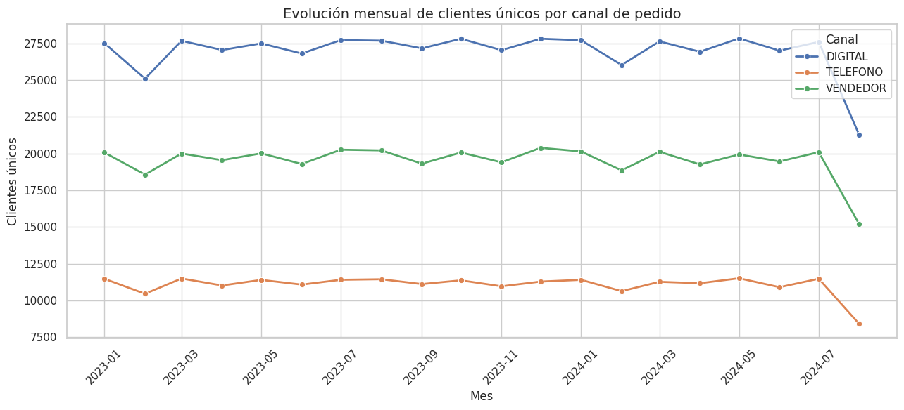
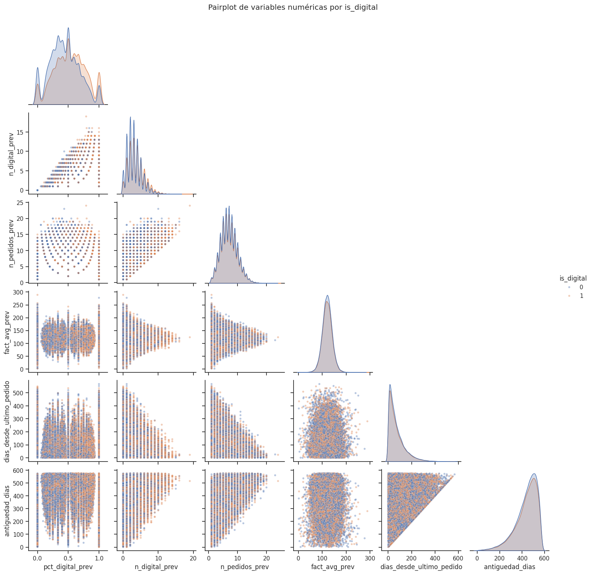
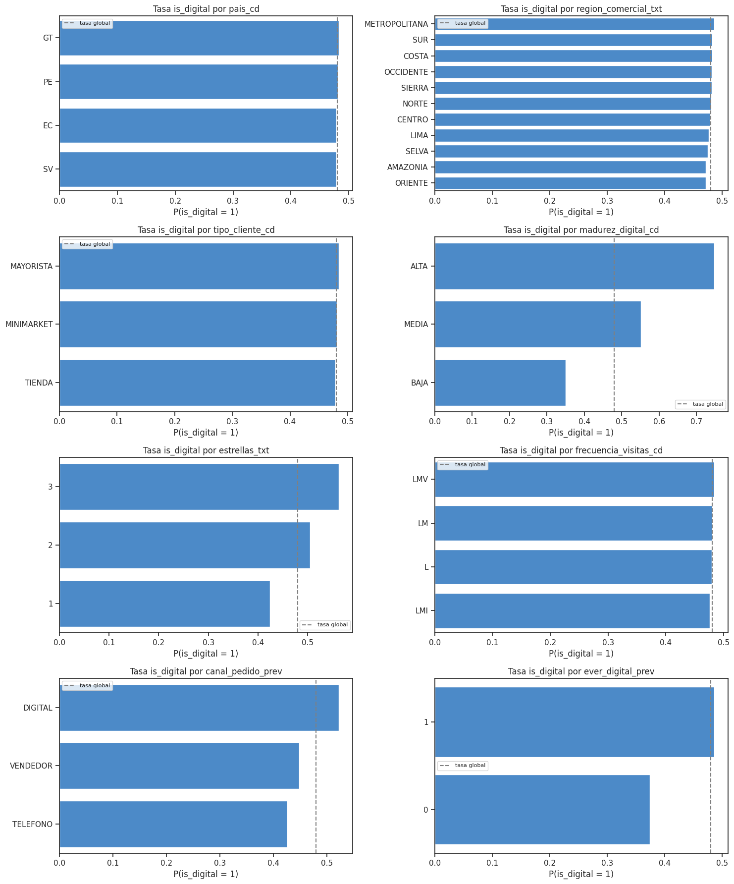
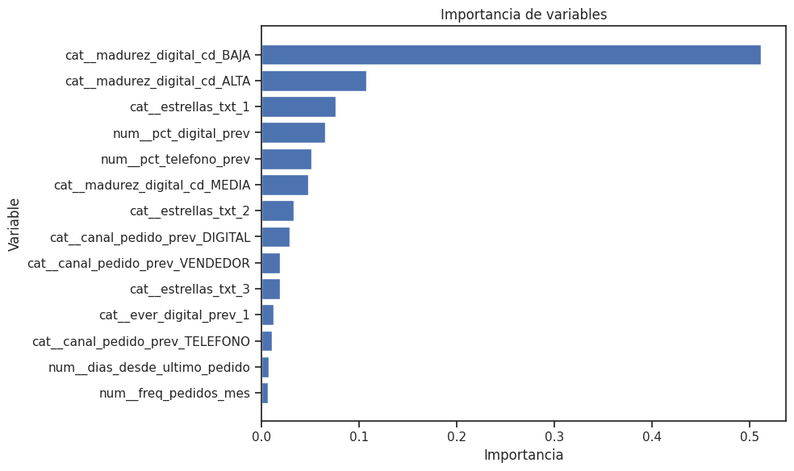

# Predicción de Pedidos Digitales en eB2B

Estimación de la probabilidad de que el **próximo pedido** de un cliente se realice por **canal digital**, con el fin de enfocar esfuerzos comerciales y de comunicación en la plataforma eB2B.

---

## 1. Enfoque seguido

### 1.1 Datos

Dataset transaccional. Además de los campos del enunciado, el dataset entregado incluye dimensiones adicionales del cliente:

| Campo | Tipo | Descripción |
|---|---|---|
| `cliente_id` | id | Identificador del cliente |
| `pais_cd`, `region_comercial_txt` | categórica | Geografía comercial |
| `agencia_id`, `ruta_id` | categórica | Estructura de distribución |
| `tipo_cliente_cd` | categórica | Segmento de cliente |
| `madurez_digital_cd`, `estrellas_txt` | categórica | Atributos de perfil  |
| `frecuencia_visitas_cd` | categórica | Frecuencia de visita comercial |
| `fecha_pedido_dt` | timestamp | Fecha del pedido |
| `canal_pedido_cd` | categórica | DIGITAL / VENDEDOR / TELEFONO |
| `facturacion_usd_val`, `materiales_distintos_val`, `cajas_fisicas` | numérica | Métricas del pedido |

**Periodo cubierto:** 2023-01-01 a 2024-08-23.

### 1.2 Definición del problema y de la target

El dataset es transaccional, pero se resume la información a nivel de cliente, en donde:

- **Target** = canal utilizado del **último pedido** de cada cliente.
- **Features** = construidas **exclusivamente con los pedidos anteriores** a ese último pedido.

Se aborda como un problema de **clasificación binaria** sobre la variable objetivo,  

- `1` → el próximo pedido del cliente es **digital**
- `0` → el próximo pedido es **no digital** (vendedor o teléfono)

Una vez definida la target me gusta ver cómo será la separación temporal para el train test y las features potenciales que voy a utilizar, armo el siguiente esquema:


### 1.3 Feature engineering

Las variables se agruparon por el comportamiento que capturan:

- **Afinidad digital / historial de canal:** `pct_digital_prev`, `pct_telefono_prev`, `pct_vendedor_prev`, `n_digital_prev`, `ever_digital_prev`, `canal_pedido_prev`.
- **Recencia / frecuencia / antigüedad (RFM):** `n_pedidos_prev`, `dias_desde_ultimo_pedido`, `antiguedad_dias`, `freq_pedidos_mes`.
- **Valor / cesta:** `fact_avg_prev`, `fact_total_prev`, `materiales_avg_prev`, `cajas_avg_prev`.
- **Perfil estático:** `pais_cd`, `region_comercial_txt`, `tipo_cliente_cd`, `madurez_digital_cd`, `estrellas_txt`, `frecuencia_visitas_cd`.

### 1.4 División train / test

Split **temporal** según la fecha del último pedido de cada cliente, con fecha de corte **[2024-08-01]**, buscando una proporción ~70/30.

| Conjunto | Nº clientes | % |
|---|---|---|
| Train | _[108,682]_ | _[72.6%]_ | 
| Test | _[40,973]_ | _[27.4%]_ | 

Un split aleatorio mezclaría pasado y futuro del mismo cliente e inflaría las métricas; el corte temporal evita ese sesgo y además permite observar como cambia la distribución en el tiempo por eso es importante el monitoreo periodico de modelos mediante backtesting.

### 1.5 Análisis exploratorio de datos

- **Evolución mensual por canal**:

La mayoría de clientes prefieren el canal digital, seguido de clientes que prefieren comprar mediante el vendedor y por teléfono. Se requiere este modelo para enfocar esfuerzos en clientes que más probablemente escojan el canal digital. 



- **Numéricas:**

Aquí tenemos un problema, ninguna feature numérica ayuda a separar la target por si sola, la única variable que ayuda a separar un poco es **pct_digital_prev** o porcentaje de clientes digitales previos. Algo que no podemos visualizar es cómo se comportan estás variables en conjunto, quizas con interacciones o en el mismo espacio multidimensional si nos ayuden a separar, mientras tanto continuamos con el análisis.



- **Categóricas:**

Las variables categoricas si nos ayudan a separar mejor la target, específicamente las variables **madurez_digital_cd**, **canal_pedido_prev** y **estrellas_txt**



### 1.6 Preprocesamiento y selección de features

Para la selección de características suelo optar por mutual-information y la correlación directa de las variables con la target, como primera aproximación, se nota que desde ya las variables no aportan demasiada información para predecir la target, se decidió aún así ocupar todas las variables hasta este punto.

Para descartar varaibles hice la prueba VIF de inflación de la varianza para no tener problemas de multicolinealidad, descartando algunas variables altamente correlacionadas finalmente me quedé con:

- **Features finales:**
  - Categóricas (One-Hot Encoding): `madurez_digital_cd`, `estrellas_txt`, `canal_pedido_prev`, `ever_digital_prev`.
  - Numéricas (MinMax scaler): `pct_digital_prev`, `pct_telefono_prev`, `dias_desde_ultimo_pedido`, `freq_pedidos_mes`.

### 1.7 Modelado

Se comparó un conjunto de modelos con validación cruzada en train y evaluación final en test, con umbral 0.5 (target balanceada, sin reponderación de clases): _Regresión Logística, Random Forest, Gradient Boosting, XGBoost, SVM, KNN, Árbol de Decisión_.

| Modelo | Accuracy | F1 (clase 1) | Precision (clase 1) | Recall (clase 1) | ROC-AUC |
|---|---|---|---|---|---|
| DecisionTree | 0.6263 | 0.6223 | 0.6074 | 0.6380 | 0.6504 |
| RandomForest | 0.6276 | 0.6214 | 0.6099 | 0.6334 | 0.6484 |
| LogisticRegression | 0.6276 | 0.6214 | 0.6099 | 0.6334 | 0.6502 |
| GradientBoosting | 0.6271 | 0.6200 | 0.6101 | 0.6302 | 0.6491 |
| XGBoost | 0.6271 | 0.6200 | 0.6100 | 0.6303 | 0.6505 |
| KNN | 0.5803 | 0.5501 | 0.5698 | 0.5317 | 0.6038 |

### 1.8 Modelo seleccionado — [XGBoost]

Se realizó también un tuning de hiperparámetros mediante el método de optimización bayesina pero no se logró incrementar las métricas.

```python
model_xg = XGBClassifier(
    colsample_bylevel      = 0.4,
    colsample_bytree       = 0.4,
    gamma                  = 3.5873054943811002,
    learning_rate          = 0.29999999999999993,
    max_depth              = 3,
    min_child_weight       = 1.0,
    n_estimators           = 600,
    reg_alpha              = 7.710007020315414,
    reg_lambda             = 0.0,
    scale_pos_weight       = 0.9473539981267164,
    subsample              = 0.6424765065021945,
    eval_metric="logloss",
    tree_method="hist",
    random_state=1997,
    n_jobs=-1,
)
```

Métricas en train y en test:

| Métrica | Train | Test | Δ (Train − Test) |
|---|---|---|---|
| Accuracy | 0.6300 | 0.6278 | 0.0022 |
| Balanced Accuracy | 0.6302 | 0.6279 | 0.0023 |
| ROC-AUC | 0.6573 | 0.6488 | 0.0085 |
| F1 (clase 1) | 0.62 | 0.62 | 0.00 |
| Precision (clase 1) | 0.61 | 0.61 | 0.00 |
| Recall / Sensitivity (clase 1) | 0.6264 | 0.6225 | 0.0039 |
| Specificity (clase 0) | 0.6340 | 0.6333 | 0.0007 |

Las métricas en train y test son prácticamente idénticas, lo que indica que el modelo no presenta sobreajuste y generaliza de forma estable. El rendimiento general del modelo es del 62% de precisión al detectar clientes que utilizarán el canal digital, lo que es bajo, pero no es porque sea un mal modelo, lo que pasa es que el rendimiento se ve limitado por la poca información que aportan las features, es necesario una ingeniería de variables más exhaustiva.

### 1.9 Importancia de variables

`madurez_digital_cd` (categoría BAJA) fue la variable más usada por el modelo, seguida de `estrellas_txt` y `pct_digital_prev`. 



---

## 2. Principales Hallazgos

1. **La adopción digital es difícil de predecir desde el histórico agregado.** La información que aportan las features es muy débil y el rendimiento ronda un accuracy de 0.62, no necesariamente por ser un mal modelo, se trata más bien de la naturaleza del problema.
2. **El predictor más informativo es la afinidad digital previa** (`pct_digital_prev`, `madurez_digital_cd`), coherente con la intuición de que el hábito digital se repite.
3. **No hay overfitting** (train ≈ test): subir la complejidad del modelo no aporta.

---

## 3. Limitaciones

- Las features actuales no permiten seperar de forma clara el 0.62 de accuracy.
- Dependencia de atributos de perfil (`madurez_digital_cd`, `estrellas_txt`) cuya lógica de construcción no está documentada; conviene validarla con el área de negocio.
- Alcance acotado al tiempo sugerido, para poder realizar una ingeniería de variables más exhaustiva.

---

## 4. Posibles mejoras

1. Encontrar más variables que me ayuden a predecir el comportamiento del cliente al momento de hacer el pédido, investigar a fondo los factores que hacen que el cliente tome esa decisión.
2. Añadir variables temporales, como tendencia reciente del canal, racha de pedidos digitales consecutivos, días desde el último pedido, estacionalidad (mes / día de semana).
3. Ajuste del umbral según el objetivo de negocio, esto podría optimizar precision o recall según a qué segmento se quiera priorizar comercialmente, en lugar del 0.5 por defecto.
4. Añadir variables codificadas o embedings de variables de alta cardinalidad como (`agencia_id`, `ruta_id`) mediante target/frequency encoding. 

